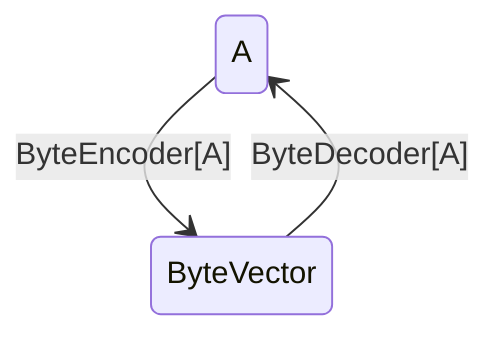

# 스칼라에서</br> 속성 기반 테스트로</br> 블록체인 개발하기

playNomm 김흥진

---

playNomm 소개

https://m.playnomm.com/

---

어떻게 해야 코드가 정확히 동작한다고 확신할 수 있을까?

---

## 이야기의 시작:

* [Curry–Howard correspondence](https://en.wikipedia.org/wiki/Curry%E2%80%93Howard_correspondence)
* 명제 : 증명 = 타입선언 : 구현

---

## Type Class Example: `ByteEncoder[A]`

```scala
trait ByteEncoder[A]:
	def encode(a: A): ByteVector
```

"ByteEncoder[A] 가 존재한다" </br> $\iff$ "타입 A는 ByteVector로 바꿀 수 있다"

---

## given

```scala

import java.time.Instant

given instantEncoder: ByteEncoder[Instant] =
  instant => ByteVector.fromLong(instant.toEpochMilli)
```

"Instant는 ByteVector로 바꿀 수 있다"


---

## using

```scala
given tupleEncoder[A, B](using
  ea: ByteEncoder[A],
  eb: ByteEncoder[B],
): ByteEncoder[(A, B)] =
  case (a: A, b: B) => ea.encode(a) ++ eb.encode(b)
```

"A, B를 각각 ByteVector로 바꿀 수 있으면 </br> 튜플 (A, B)도 ByteVector로 바꿀 수 있다."

---

## 요약

* given 주어진 사실
* using 전제조건
* 전제를 찾는 범위: companion object
  * F[A]를 찾는 범위: F 혹은 A 의 companion object

---

## 이런 것도 가능

* 튜플의 각 원소 타입에 대해서 ByteEncoder가 주어지면 튜플 전체에 대한 ByteEncoder도 존재한다
* 임의의 Case Class도 같은 타입의 튜플에 대해 ByteEncoder가 존재하면 존재한다

---

## 남은 문제들

* base case는 정확한가?
* 조합한 내용은 정확한가?

---

## example-based test

* 예시 상황에서 어떻게 작동할 지 테스트
* 생각을 시작하는데에는 도움됨
* 올바른 동작에 대해서 확신하기는 어려움

---

## property-based test

* 랜덤 생성된 예시에 대해서 특정 속성이 성립하는지 체크
* 어떤 속성을 테스트해야될 지에 대해서는 깊이있는 생각이 필요함

---

## 관련 라이브러리

[ScalaCheck](https://scalacheck.org/)

* 가장 유명함

[scala-hedgehog](https://hedgehogqa.github.io/scala-hedgehog/)

* shrinking
* state-based testing

---

## round trip test

* ByteEncoder / ByteDecoder



---

## State-based testing(1/3)


---

## State-based testing(2/3)

Merkle Trie

* 포인터가 해시값으로 되어 있는 prefix 트리
* 루트 노드의 해시값으로 트리 전체 내용 요약가능
* 사전순 순회 가능

---

## State-based testing(3/3)

어떤 특성을 유지해야 하는가?
* TreeMap과 같은 동작
* 요약값이 일치하면 내용도 일치해야 함

---

## 그 외의 패턴들(1/5)

다른 경로 같은 도착지점

* Commutativity
* Associativity
* Map
* Monad & Functor laws

---

## 그 외의 패턴들(2/5)

불변식

* 컬렉션에서 map 함수: 컬렉션 크기
* 컬렉션에서 정렬: 컬렉션 내용
* Balanced Tree: 높이가 일정

---

## 그 외의 패턴들(3/5)

Idempotence(멱등성)

> 한 번 적용하기 = 두 번 이상 적용하기

* Sort
* Filter
* Event processing
* distributed designs

---

## 그 외의 패턴들(4/5)

Induction
> 작은 문제로 쪼개서 검증

* Divide and conquer algorithm ( e.g. quicksort)
* Structural induction (recursive data structure)

---

## 그 외의 패턴들(5/5)

블랙박스 테스팅
> 증명은 어렵고 검증은 쉬운 문제들

* 소인수분해(다시 곱하면 원래 숫자)
* String tokenizer (다시 concat하면 원래대로 돌아옴)
* 정렬 (모든 인접 페어에 대해 크기 비교)
